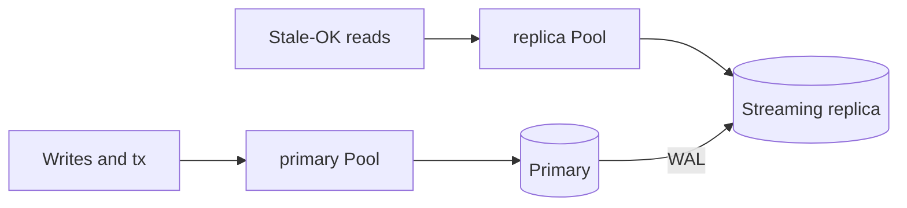

# caerus-framework-postgresql

[](https://github.com/caerus-framework/caerus-framework-postgresql/actions/workflows/ci.yml)
[](https://codecov.io/gh/caerus-framework/caerus-framework-postgresql)
[](LICENSE)


Caerus Framework PostgreSQL Component. Wraps a [pgx](https://github.com/jackc/pgx)
connection pool (`pgxpool`), verifies connectivity at `Init` (fail-fast), and
closes it at `Shutdown`. Registers in the `data` initialization stage.

## Not an ORM — the ops chassis for Postgres

This module owns the **connection & ops chassis**, not your queries. Write SQL
with [sqlc](https://sqlc.dev) or pgx against `Pool()` (and `WithinTx` for
transactions); this component owns everything around it:

- pool lifecycle: `Init` fail-fast ping, `Shutdown`, `Health` (`/readyz`)
- live reload / reconnect from a configuration source (`WithConfigSource`)
- migrate Job + CLI (`WithMigrations` / `Migrate` / framework job flag)
- day-2 ops: pool metrics, `WithQueryTracer` hooks, TLS file rotation, timeouts

Non-goals: ActiveRecord, auto-migrate from structs, `Repository[T]`, hiding
`Pool()`.

### Service checklist

For every new service using this component:

- [ ] `Health` wired — observability `/readyz` auto-discovers `HealthProvider`
- [ ] Schema via `WithMigrations` + `--postgresql.job=migrate` (or `WithEmbeddedMigrations`
      for `//go:embed` FS) as a K8s Job **before** the Deployment; serving pods omit `WithMigrateOnInit`
- [ ] `WithConfigSource("…")` for file-based config (External Secrets rotation)
- [ ] `WithName` + `GetByName` when a process needs primary + replica
- [ ] Confirm `postgresql_pool_*` on `/metrics` (pool saturation visible)

## Wiring

Two wiring shapes. Prefer the **app-owned** shape.

### App-owned consumer (golden — demoapp pattern)

`main` declares postgres as chassis. The app holds `*CFPostgres` and calls
`Pool()` **per use** (never copy the pool at Init — reload/reconnect swap
it).

```go
fw := cf.New(&cf.FrameworkOptions{
	Logs:          &cf.LogsSettings{Format: "json", Level: "info", ConfigSource: "logs"},
	Observability: &cf.ObservabilitySettings{Address: ":9090", ConfigSource: "observability"},
	Components: []cf.CaerusComponent{
		cf_postgres.New(cf_postgres.WithConfigSource("postgresql", "config/postgresql.json")),
		app.New(),
	},
})
```

```go
type App struct {
	pg *cf_postgres.CFPostgres
}

func (a *App) GetDependencies() []string {
	return []string{cf_postgres.ComponentName}
}

func (a *App) Init(ctx context.Context, fw *cf.CaerusFramework) error {
	pg, ok := cf.Get[*cf_postgres.CFPostgres](fw)
	if !ok {
		return errors.New("app: postgresql missing")
	}
	a.pg = pg
	return nil
}

func (a *App) note(ctx context.Context, id int) (string, error) {
	var note string
	err := a.pg.Pool().QueryRow(ctx, "SELECT note FROM notes WHERE id = $1", id).Scan(&note)
	return note, err
}
```

A store or sqlc helper is the same idea: hold `*CFPostgres`, never a
`*pgxpool.Pool` from Init.

```go
type Store struct {
	pg *cf_postgres.CFPostgres
}

func New(pg *cf_postgres.CFPostgres) *Store { return &Store{pg: pg} }

func (s *Store) queries() *db.Queries {
	return db.New(s.pg.Pool()) // sqlc New per call — cheap; pool is live
}
```

```text
Wrong: store.New(pg.Pool()) at Init, or q := db.New(pg.Pool()) kept on the
       struct. After reload/reconnect the component closes that pool.
Right: store.New(pg) with *CFPostgres; Pool() / db.New(pg.Pool()) per query.
```

### Simple `main`-level wiring

```go
fw := cf.New()
fw.AddComponent(cf_logs.New(cf_logs.WithWriter(os.Stdout)))
fw.AddComponent(cf_postgres.New(
	cf_postgres.WithHost("127.0.0.1"),
	cf_postgres.WithDatabase("mydb"),
))
```

Then `cf.MustGet[*cf_postgres.CFPostgres](fw)`. Still `Pool()` per use.

With `degraded_mode`, Init can succeed while Postgres is down. A background
loop retries ping/rebuild until the server is up. `Health` stays not-ready
unless `health_when_degraded` is `ready`.

## Usage

After `fw.Run` (or in any component whose stage runs after `data`), call
`Pool()` **on the component** for each query. Do not keep the `*pgxpool.Pool`
value from Init.

```go
pg := cf.MustGet[*cf_postgres.CFPostgres](fw)

var note string
err := pg.Pool().QueryRow(ctx, "SELECT note FROM notes WHERE id = $1", 42).Scan(&note)
```

The pool provides connection reuse, health-checked idle connections, and safe
concurrency.

### Transactions

Use `WithinTx` for multi-statement atomic operations — commit on `nil`,
rollback on error or a canceled context:

```go
pg := cf.MustGet[*cf_postgres.CFPostgres](fw)
err := pg.WithinTx(ctx, func(tx pgx.Tx) error {
    if _, err := tx.Exec(ctx, "INSERT INTO a (id) VALUES ($1)", 1); err != nil {
        return err
    }
    _, err := tx.Exec(ctx, "INSERT INTO b (id) VALUES ($1)", 1)
    return err
})
```

For more control (`pgx.TxOptions`, savepoints) use `pool.Begin(ctx)` and
`pgx.Tx` directly — `WithinTx` is the common case, not a transaction API.

## Options

| Option | Description |
| --- | --- |
| `WithConfig(PostgresConfig)` | connection config loaded from the configuration component; non-zero fields override option-set defaults |
| `WithPoolConfig(*pgxpool.Config)` | full pgxpool.Config (deep-copied); call before convenience setters you want overridden |
| `WithConnString(dsn)` | full connection string (DSN or URL), parsed via `pgxpool.ParseConfig`; bad DSN fails at `Init` |
| `WithHost(h)` | server host (default `127.0.0.1`) |
| `WithPort(p)` | server port (default `5432`) |
| `WithUser(u)` | role to connect as (default: current OS user) |
| `WithPassword(p)` | authentication password |
| `WithDatabase(d)` | database name (default: the user name) |
| `WithSSLMode(m)` | `disable`, `prefer`, `require`, `verify-ca`, `verify-full` (default `prefer`); unknown mode fails at `Init` |
| `WithApplicationName(n)` | sets the `application_name` runtime parameter |
| `WithStatementTimeout(d)` | per-connection `statement_timeout` runtime parameter (ms); 0 = unset |
| `WithLockTimeout(d)` | per-connection `lock_timeout` runtime parameter (ms); 0 = unset |
| `WithTLSRootCAFile(path)` | PEM CA bundle to verify the server (mTLS/private CA); re-read on every connect/reload |
| `WithTLSClientCertFile(cert, key)` | PEM client cert + key for mTLS; re-read on every connect/reload |
| `WithMaxConns(n)` | pool max connections (default `max(4, GOMAXPROCS)`) |
| `WithMinConns(n)` | pool min connections (default `0`) |
| `WithMaxConnLifetime(d)` | max connection age (default `1h`) |
| `WithMaxConnIdleTime(d)` | max idle time (default `30m`) |
| `WithHealthCheckPeriod(d)` | idle health-check interval (default `1m`) |
| `WithConnectTimeout(d)` | per-attempt connect timeout (default `0` = none, libpq default) |
| `WithPingTimeout(d)` | Init connectivity-ping timeout (default `5s`) |
| `WithDegradedMode(bool)` | when true, Init may succeed without a live ping/pool (default **off** / hard-fail) |
| `WithHealthWhenDegraded("not_ready"\|"ready")` | `/readyz` while degraded: default `not_ready`; `ready` is break-glass LB traffic |
| `WithMigrations(fsys, opts...)` | configure a migration FS (already rooted at the `.up.sql`/`.down.sql` dir) for `Migrate` / the framework job flag |
| `WithEmbeddedMigrations(fsys, dir, opts...)` | like `WithMigrations` but takes the `//go:embed` FS + directory and resolves the sub-FS internally (mismatched dir panics at construction) |
| `WithMigrateOnInit()` | `Init` calls `Migrate` (local/single-replica only) |
| `WithMigrationsTable(name)` | migrations tracking table (default `schema_migrations`) |
| `WithName(name)` | custom component name for multiple instances (default `"postgresql"`) |
| `WithQueryTracer(pgx.QueryTracer)` | pgx query tracer around every Query/QueryRow/Exec; survives pool rebuilds on config reload |
| `WithLogger(*slog.Logger)` | explicit logger override; defaults to the framework `logs` component's logger (re-delivered on `logs` `Reconfigure`), falling back to `slog.Default()` |

## Query tracing

`WithQueryTracer` exposes pgx's own hook seam (`TraceQueryStart` /
`TraceQueryEnd`, invoked around every `Query`, `QueryRow`, and `Exec`), so you
can attach tracing or slow-query logging without importing an instrumentation
library into this module — the tracer interface lives in pgx. An OpenTelemetry
example (the otel import lives in **your** app, not here):

```go
import (
    "context"

    "github.com/jackc/pgx/v5"
    "go.opentelemetry.io/otel"
    "go.opentelemetry.io/otel/trace"
)

type ctxKey struct{}

type spanTracer struct{ tracer string }

func (t spanTracer) TraceQueryStart(ctx context.Context, conn *pgx.Conn,
    data pgx.TraceQueryStartData) context.Context {
    ctx, span := otel.Tracer(t.tracer).Start(ctx, "postgres:"+data.SQL)
    return context.WithValue(ctx, ctxKey{}, span)
}

func (t spanTracer) TraceQueryEnd(ctx context.Context, conn *pgx.Conn, data pgx.TraceQueryEndData) {
    span, ok := ctx.Value(ctxKey{}).(trace.Span)
    if !ok {
        return
    }
    if data.Err != nil {
        span.RecordError(data.Err)
    }
    span.End()
}

p := cf_postgres.New(cf_postgres.WithConnString("postgres://..."),
    cf_postgres.WithQueryTracer(spanTracer{tracer: "postgres"}))
```

The tracer is part of the option base config, so a `WithConfigSource` reload
rebuilds the pool with the same tracer. Pgx calls a single tracer per query;
chain several with a small composite type. `BatchTracer` / `ConnectTracer` /
pool acquire tracing are secondary and not exposed — use
`WithPoolConfig` if you need them.

## Multiple instances

A **read replica** is a second Postgres that **replays** the primary’s
WAL. It is not a second schema you migrate, and it is not “Postgres but
faster.” Use it when some queries can be **seconds behind** (exports,
dashboards). Auth-style “I just saved, show me the row” stays on the
**primary**.

Caerus already decided how that looks in process: **two components**,
`WithName`, two config files, `GetByName`, `Pool()` per use. Do **not**
put `replica_dsn` on one `PostgresConfig` or make `Pool()` pick a
server. Health, metrics, migrate jobs, and TLS reload are per
`Name()`. A silent split is how on-call cannot tell which DSN died.

`GetDependencies` lists those **component** names (what `Name()`
returns), not a source nickname. When two instances exist,
`cf.Get[*cf_postgres.CFPostgres]` is ambiguous and returns false — use
`GetByName`.

```go
pri := cf_postgres.New(
    cf_postgres.WithName("primary"),
    cf_postgres.WithConfigSource("postgresql", "config/postgresql.json"),
)
rep := cf_postgres.New(
    cf_postgres.WithName("replica"),
    cf_postgres.WithConfigSource("postgresql-replica", "config/postgresql-replica.json"),
)
fw.AddComponent(pri)
fw.AddComponent(rep)

primary := cf.MustGetByName[*cf_postgres.CFPostgres](fw, "primary")
replica := cf.MustGetByName[*cf_postgres.CFPostgres](fw, "replica")
err := replica.Pool().QueryRow(ctx, "SELECT 1").Scan(&n)
```

Writes, transactions, and read-your-writes: `primary.Pool()`. Stale-OK
reads: `replica.Pool()`. Only **primary** runs
`--postgresql.job=migrate` (or `--postgresql.primary.job=migrate` when
`WithName("primary")`). The replica is a streaming copy.



### Readiness: two process shapes

`/readyz` is red if **any** `HealthProvider` fails. A replica in the
**API** process that cannot ping takes **checkout** out of the Service
even when primary is fine.

**Path A — Replica in the API pod** (optional reads on the user request):
replica `degraded_mode` + `health_when_degraded: ready` so a dead
replica does not drain traffic; metrics must scream; checkout must not
require the replica.

**Path B — Replica only on reporting/worker pods** (usual when those
reads are not checkout): API registers **primary only**. Reporting pods
register the replica. Each process’s `/readyz` matches that process’s
job.

### Mix-ups that show up in postmortems

These are identity mistakes, not “Postgres is slow.”

1. **Magic `Pool()`** — one component, two DSNs, driver or wrapper
   routes SELECTs. Logs and `/readyz` name a single `postgresql`. You
   cannot tell which host failed.
2. **Read-your-writes on the replica** — user saves, next GET hits the
   replica before WAL apply. Looks like data loss. CI often has zero
   lag, so tests stay green. Keep “I just wrote this” on primary.
3. **`/readyz` AND’s the replica** — replica blip pages as “the app is
   down.” Use Path A (degraded-ready replica) or Path B (replica not in
   the API graph).
4. **Writes or migrate on the replica** — `cannot execute … in a
   read-only transaction`, or `--postgresql.replica.job=migrate` treating
   the standby as a second schema. Migrate **primary** only. sqlc writes
   use `primary.Pool()`.
5. **DSN / endpoint swap** — copy-paste leaves both files on the writer,
   or after failover the “reader” CNAME is now the writer. The component
   is still named `replica` but it is the primary (or both names hit one
   host). Check `host` on `postgresql_info` / connect logs per
   `component` label; do not trust the filename alone.

Wrong: `replica_dsn` on one struct; `store.New(pg.Pool())` snapshot;
checkout `GetDependencies` includes replica with default not-ready
Health.  
Right: two named `*CFPostgres`; `Pool()` per use; readyz matches the
Deployment’s job.

## Migrations

Files use the [golang-migrate](https://github.com/golang-migrate/migrate)
layout (`<version>_<name>.up.sql` / `.down.sql`), may contain multiple
statements, and run under an advisory lock against the same pool TLS/credentials
as the app. "Already up to date" is success.

### Production policy (Job flag, not Init)

| Environment | Pattern |
|---|---|
| **K8s / multi-replica** | Same image; Job args `--postgresql.job=migrate` (the flag is **declared by this module** on its own configuration source — see [Same binary: `--postgresql.job=migrate`](#same-binary---postgresqljobmigrate)). Serving Deployment **omits** `WithMigrateOnInit` (keep `WithMigrations` so the Job can migrate). |
| **Local / single-replica** | `WithMigrations` + `WithMigrateOnInit()` so `Init` migrates after ping. |

Do **not** use `WithMigrateOnInit` on every replica of a Deployment. See
[Dirty migrations](#dirty-migrations) when a Job crashes mid-apply.

### Dirty migrations

golang-migrate tracks `(version, dirty)` in the migrations table (default
`schema_migrations`). While an up is in progress the row is **dirty**. If the
process dies mid-version, further `Up` calls fail until an operator repairs
state — Caerus **does not** auto-`force`.

| Situation | What happens |
|---|---|
| Concurrent migrate Jobs / Init | Serialized by golang-migrate’s **Postgres advisory lock** on that database |
| Job re-run when already current | Success (`ErrNoChange` / “up to date”) — safe and expected |
| Crash mid-version | Dirty set → later migrate Jobs fail closed until repaired |

**Why no auto-force:** dirty means “we do not know whether version *N*’s SQL
finished.” Clearing the flag without inspecting the database can mark a
half-applied schema as done. Silent heal is how replicas diverge.

**Operator runbook (default):**

1. Fail the release / stop serving until fixed (Job failed; Deployment should
   not have started).
2. Inspect DB + Job logs: did objects from version *N* exist?
3. Either finish the up manually, or undo partial objects (hand SQL / careful
   use of the matching `.down.sql`). golang-migrate does **not** auto-run downs
   on crash.
4. `migrate force VERSION` to the **true** clean version (clears dirty).
5. Re-run `myapp --postgresql.job=migrate` (or `--postgresql.<name>.job=migrate`).

**Reducing how often this hurts:** keep versions small; prefer expand/contract
and idempotent ups; avoid irreversible DDL in the middle of a multi-statement
version. Prod rollback of a bad up is usually restore/PITR or a forward fix,
not a casual `Down`.

**Not in this module:** automatic dirty policies (`force` to *N* or *N−1* and
retry). If a product ever adds that, it must be an explicit opt-in with a
documented assumption that ups are safe to retry — never the default `Migrate`
path.

### Same binary: `--postgresql.job=migrate`

Wire postgres once with `WithMigrations`. The module declares the job flag on
its own configuration source (`Source.Job: cf.JobSpec{Flag: "postgresql.job",
Tasks: ["migrate"]}`), so configuration parses/validates the value like any
other setting. The **flag names the instance** and the **value names the task**
(`--postgresql.job=migrate`, or `--postgresql.orders.job=migrate` for a
`WithName("orders")` instance). Jobs are **CLI-only** — the task never flows
from env or file. `RunWithSignals` asks configuration (via `cf.JobSource`) and
runs only the core plus the **named** postgres component's `RunJob` (`migrate`
→ `Migrate`), then exits — no serve ceremony:

```go
import "embed"

//go:embed migrations
var migrations embed.FS

func main() {
	ctx := context.Background()

	fw := cf.New(&cf.FrameworkOptions{
		Components: []cf.CaerusComponent{
			cf_postgres.New(
				cf_postgres.WithConfigSource("postgresql", "config.yaml"),
				cf_postgres.WithEmbeddedMigrations(migrations, "migrations"),
				// cf_postgres.WithMigrateOnInit(), // local only
			),
			// … logs/configuration/observability are auto-registered core …
			app, // Runnable
		},
	})

	if err := fw.RunWithSignals(ctx,
		cf.WithShutdownTimeout(15*time.Second),
	); err != nil {
		log.Fatal(err)
	}
}
```

Run it as `myapp --postgresql.job=migrate` (K8s Job), or call
`fw.Migrate(ctx, "postgresql")` directly from a migrate subcommand in a
multi-tool binary.

| Invocation | Behavior |
|---|---|
| `myapp --postgresql.job=migrate` | `Initialize` (core + named postgres) → `RunJob("migrate")` → `Shutdown` → exit |
| `myapp --postgresql.orders.job=migrate` | Same, on the `WithName("orders")` instance |
| `myapp` (serve) | Normal `RunWithSignals`; no migrate unless `WithMigrateOnInit` |

### `Migrate(ctx)` (explicit API)

```go
if err := postgres.Migrate(ctx); err != nil {
	log.Fatal(err)
}
```

Requires `Init` (live pool) and a migrations FS (`WithMigrations` or
`WithEmbeddedMigrations`). Prefer the framework job flag
(`--postgresql.job=migrate`) or `fw.Migrate(ctx, target)` for Jobs.

### Helm / GitOps Job before Deployment

- `batch/v1` Job (or Helm `pre-install`/`pre-upgrade` hook, or Argo sync-wave `-1`).
- Same container image; `args: ["--postgresql.job=migrate"]` (or equivalent).
- Same DB secret/config as the API.
- `restartPolicy: Never`; fail the release if the Job fails.
- Deployment pods start only after the Job succeeds; readiness is `/readyz`.

Migration files under `fsys`:

```
migrations/
  000001_init.up.sql
  000001_init.down.sql
```

Shared databases: give each service its own tracking table via
`WithMigrationsTable` (e.g. `orders_migrations`). Default is `schema_migrations`.

## Configuration

Drive connection settings via `caerus-framework-configuration` (file → env →
DSN). `PostgresConfig` has json/yaml/`env` tags. Durations are in seconds.

The module is **self-sufficient**: `WithConfigSource(name, path)` registers its
own `Source[PostgresConfig]` with the configuration component (via
`cf.ConfigSourceRegistrar`, run by the framework during argv absorption). The
default `EnvPrefix` is the uppercase source name (`"postgresql"` →
`"POSTGRESQL_"`); override with `WithSourceEnvPrefix("POSTGRES_")`. `POSTGRES_DSN`
is overlaid in `AfterLoad` inside the module. `main` only points the instance at
where config lives:

```go
postgres := cf_postgres.New(
	cf_postgres.WithConfigSource("postgresql", "config.yaml"), // Init + OnConfigReload reconnect
)
```

For low-level control (custom `AfterLoad`, format, env prefix), register the
source manually instead:

```go
conf := cf_configuration.New()
_ = fw.AddComponent(conf)
_ = cf_configuration.AddSource(conf, cf_configuration.Source[cf_postgres.PostgresConfig]{
	Name:      "postgresql",
	Path:      "config.yaml", // optional if EnvPrefix set
	Format:    cf_configuration.FormatYAML,
	Owner:     cf_postgres.ComponentName,
	EnvPrefix: "POSTGRES_",
	AfterLoad: func(c *cf_postgres.PostgresConfig) error {
		if dsn := os.Getenv("POSTGRES_DSN"); dsn != "" {
			return cf_postgres.OverlayDSN(c, dsn) // wins over file+env fields
		}
		return nil
	},
})

postgres := cf_postgres.New(
	cf_postgres.WithConfigSource("postgresql", ""), // bind by name only
)
```

Helpers: `ParseDSN` / `OverlayDSN` for `postgres://` URLs and keyword DSNs.
`ParseDSN` errors never include the raw DSN (pgx would interpolate the
password). `Password` is tagged `secret:"redact"`: `LogArgs` prints
`[redacted]`, connect/reload logs use `password_set` only. Do not log the
config struct.
`WithConfigSource` implements `ConfigReloader`: on file reload (or
`cfg.Reload`), builds a new pool, pings, swaps, closes the old pool; on failure
keeps the previous pool. In Kubernetes prefer file-mounted secrets for
rotation; use env/DSN for local and CI.

## Fail-fast behaviour (default)

`Init` creates the pool, pings the server, and applies pending migrations. If
the connection is refused, the ping times out, or a migration fails, `Init`
returns an error and startup aborts before any dependent component runs.
`Pool()` returns `nil` before `Init` or after `Shutdown`.

## DegradedMode (optional break-glass)

**Not automatic.** Default remains hard Init. Set `degraded_mode: true` (or
`WithDegradedMode(true)`) when the process must finish Initialize even if
Postgres is unreachable. Migrate-on-Init and migrate Jobs still need a live
pool — DegradedMode is for serve/break-glass shapes, not for skipping schema
work.

```json
{
  "host": "postgres",
  "port": 5432,
  "user": "app",
  "password": "…",
  "database": "app",
  "degraded_mode": true,
  "health_when_degraded": "not_ready"
}
```

| Setting | Meaning |
|---|---|
| `degraded_mode` | Init may succeed without a successful ping/create; logs/metrics scream (`degraded_unreachable`, `degraded_mode_uses_total`). **Default off.** |
| `health_when_degraded: "not_ready"` | Default — `Health` still fails → `/readyz` 503 while disconnected. |
| `health_when_degraded: "ready"` | Break-glass — `Health` returns nil while down so LB may send traffic. Use deliberately; prefer not lying about DB-backed routes on the same pod. |

DegradedMode answers “may Initialize finish?” — it does **not** mean the
database is healthy. Hot reload of the postgresql source can rebuild the pool
when the file updates; env alone does not wake a running process.

## Observability

`CFPostgres` implements `cf.HealthProvider`: `Health(ctx)` pings the pool, so
the `observability` component's `/readyz` endpoint reflects real database
connectivity. Before `Init` or after `Shutdown` (nil pool) it reports unhealthy.
After DegradedMode without a live ping, behaviour follows `health_when_degraded`.

It also implements `cf.MetricsProvider`: while connected it contributes
`postgresql_info` plus pool gauges and counters to `/metrics` (all
labeled `database`, `user`, `host`, `port`, `component` = `Name()`):

| Metric | Type | Meaning |
|---|---|---|
| `postgresql_degraded_unreachable` | gauge | 1 when running without a successful ping (DegradedMode / lost connectivity) |
| `postgresql_degraded_mode_uses_total` | counter | times Init continued after failed ping/create under DegradedMode |
| `postgresql_pool_idle` | gauge | idle connections |
| `postgresql_pool_total` | gauge | total connections |
| `postgresql_pool_max` | gauge | pool maximum |
| `postgresql_pool_acquired` | gauge | currently acquired |
| `postgresql_pool_constructing` | gauge | dials still in flight |
| `postgresql_pool_acquire_total` | counter | cumulative successful acquires |
| `postgresql_pool_empty_acquire_total` | counter | acquires that had to wait |
| `postgresql_pool_canceled_acquire_total` | counter | acquires canceled by context |
| `postgresql_pool_acquire_duration_seconds` | counter | cumulative time in successful acquires |
| `postgresql_pool_empty_acquire_wait_seconds` | counter | cumulative wait while the pool was empty |
| `postgresql_pool_new_conns_total` | counter | new connections opened |
| `postgresql_pool_max_lifetime_destroy_total` | counter | closed for MaxConnLifetime |
| `postgresql_pool_max_idle_destroy_total` | counter | closed for MaxConnIdleTime |

Scrape `postgresql_pool_acquired / max` for **pool saturation**. When
saturation looks fine but latency is not, use wait time:

`rate(postgresql_pool_empty_acquire_wait_seconds[5m])` and
`rate(postgresql_pool_empty_acquire_wait_seconds[5m]) / rate(postgresql_pool_empty_acquire_total[5m])`
(mean wait when the pool was empty). Churn:
`rate(postgresql_pool_new_conns_total[5m])` vs
`rate(postgresql_pool_max_lifetime_destroy_total[5m])` /
`rate(postgresql_pool_max_idle_destroy_total[5m])`. Counters reset when the pool is rebuilt
(reload / reconnect). Before `Init` or after `Shutdown` it reports nothing
(lazy pickup).

## Tests

Unit tests cover the component contract without a server. Integration tests are
gated on `POSTGRES_ADDR` (or `POSTGRES_DSN` for full control):

```
POSTGRES_ADDR=127.0.0.1:5433 POSTGRES_PASSWORD=secret go test -race ./...
```

## License

Apache License 2.0 — see [LICENSE](LICENSE).
